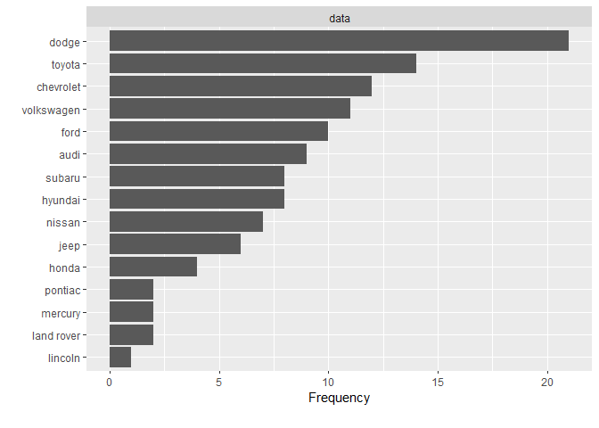
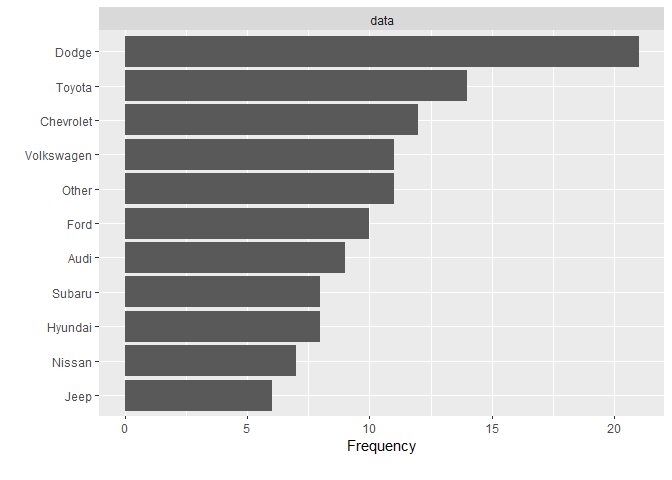
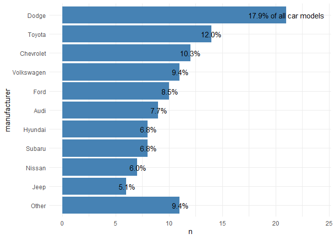
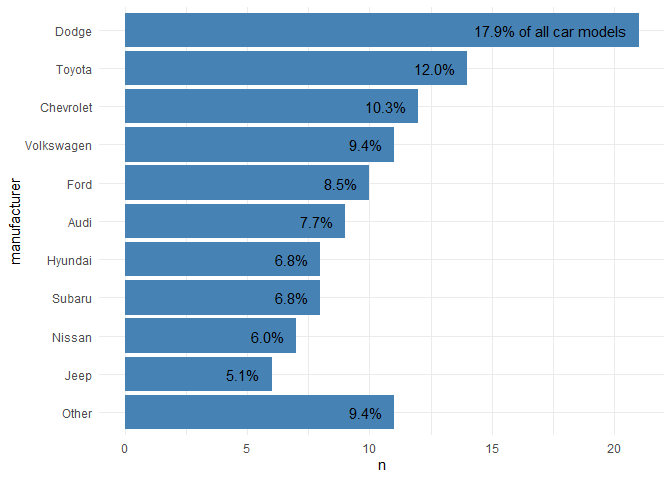
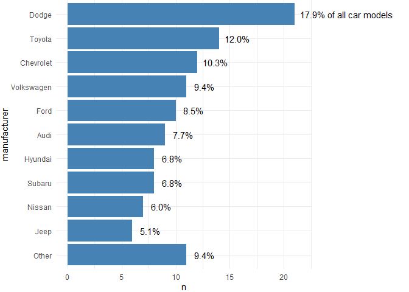
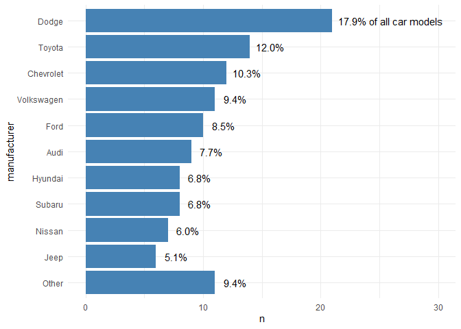
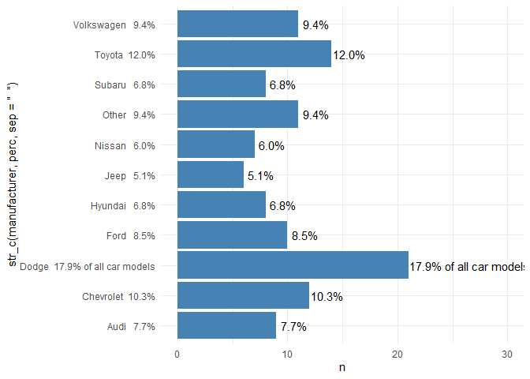
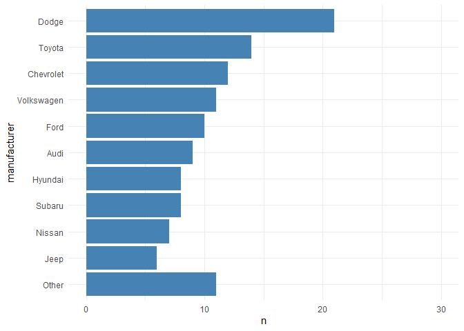

#ggplot2
#tidyverse
#data_visualization


```r
library(tidyverse)
# EDA packages
library(funModeling)
library(DataExplorer)
```

Dataset references can be found at [Fuel economy data from 1999 to 2008 for 38 popular models of cars](https://ggplot2.tidyverse.org/reference/mpg.html)

# Check the variables


```r
df_status(mpg)
```

```
##        variable q_zeros p_zeros q_na p_na q_inf p_inf      type unique
## 1  manufacturer       0       0    0    0     0     0 character     15
## 2         model       0       0    0    0     0     0 character     38
## 3         displ       0       0    0    0     0     0   numeric     35
## 4          year       0       0    0    0     0     0   integer      2
## 5           cyl       0       0    0    0     0     0   integer      4
## 6         trans       0       0    0    0     0     0 character     10
## 7           drv       0       0    0    0     0     0 character      3
## 8           cty       0       0    0    0     0     0   integer     21
## 9           hwy       0       0    0    0     0     0   integer     27
## 10           fl       0       0    0    0     0     0 character      5
## 11        class       0       0    0    0     0     0 character      7
```

# Create the dataset


```r
mpg_sum <- mpg %>%
  # just use 2008 data
  dplyr::filter(year == 2008)

# Examining the variable 'manufacturer'
str(mpg_sum$manufacturer)
```

```
##  chr [1:117] "audi" "audi" "audi" "audi" "audi" "audi" "audi" "audi" "audi" ...
```

```r
# or
glimpse(mpg_sum$manufacturer)
```

```
##  chr [1:117] "audi" "audi" "audi" "audi" "audi" "audi" "audi" "audi" "audi" ...
```

```r
summary(mpg_sum$manufacturer)
```

```
##    Length     Class      Mode 
##       117 character character
```

```r
table(mpg_sum$manufacturer) # 15 manufacturers
```

```
## 
##       audi  chevrolet      dodge       ford      honda    hyundai       jeep 
##          9         12         21         10          4          8          6 
## land rover    lincoln    mercury     nissan    pontiac     subaru     toyota 
##          2          1          2          7          2          8         14 
## volkswagen 
##         11
```

```r
# factolevels()
levels(mpg_sum$manufacturer) #NULL because the variable is still a character
```

```
## NULL
```

```r
# EDA
DataExplorer::plot_bar(mpg_sum$manufacturer)
```

<!-- -->


```r
mpg_sum2 <- mpg %>%
  # just use 2008 data
  dplyr::filter(year == 2008) %>% 
  # turn into lumped factors with capitalized names
  dplyr::mutate(manufacturer = stringr::str_to_title(manufacturer),
                manufacturer = forcats::fct_lump(manufacturer, n = 10)
  )

# Examining the variable manufacturer (factor)
str(mpg_sum2$manufacturer)
```

```
##  Factor w/ 11 levels "Audi","Chevrolet",..: 1 1 1 1 1 1 1 1 1 2 ...
```

```r
# or
glimpse(mpg_sum2$manufacturer)
```

```
##  Factor w/ 11 levels "Audi","Chevrolet",..: 1 1 1 1 1 1 1 1 1 2 ...
```

```r
summary(mpg_sum2$manufacturer)
```

```
##       Audi  Chevrolet      Dodge       Ford    Hyundai       Jeep     Nissan 
##          9         12         21         10          8          6          7 
##     Subaru     Toyota Volkswagen      Other 
##          8         14         11         11
```

```r
table(mpg_sum2$manufacturer) # 10 manufacturers + Other (11 factor levels)
```

```
## 
##       Audi  Chevrolet      Dodge       Ford    Hyundai       Jeep     Nissan 
##          9         12         21         10          8          6          7 
##     Subaru     Toyota Volkswagen      Other 
##          8         14         11         11
```

```r
# factolevels()
levels(mpg_sum2$manufacturer)
```

```
##  [1] "Audi"       "Chevrolet"  "Dodge"      "Ford"       "Hyundai"   
##  [6] "Jeep"       "Nissan"     "Subaru"     "Toyota"     "Volkswagen"
## [11] "Other"
```

```r
# EDA
DataExplorer::plot_bar(mpg_sum2$manufacturer)
```

<!-- -->


```r
mpg_sum3 <- mpg %>%
  # just use 2008 data
  dplyr::filter(year == 2008) %>% 
  # turn into lumped factors with capitalized names
  dplyr::mutate(manufacturer = stringr::str_to_title(manufacturer),
                manufacturer = forcats::fct_lump(manufacturer, n = 10)
  ) %>% 
  # add counts
  count(manufacturer, sort = TRUE)

mpg_sum3
```

```
## # A tibble: 11 x 2
##    manufacturer     n
##    <fct>        <int>
##  1 Dodge           21
##  2 Toyota          14
##  3 Chevrolet       12
##  4 Volkswagen      11
##  5 Other           11
##  6 Ford            10
##  7 Audi             9
##  8 Hyundai          8
##  9 Subaru           8
## 10 Nissan           7
## 11 Jeep             6
```

```r
# factolevels()
levels(mpg_sum3$manufacturer)
```

```
##  [1] "Audi"       "Chevrolet"  "Dodge"      "Ford"       "Hyundai"   
##  [6] "Jeep"       "Nissan"     "Subaru"     "Toyota"     "Volkswagen"
## [11] "Other"
```


```r
mpg_sum4 <- mpg %>%
  # just use 2008 data
  dplyr::filter(year == 2008) %>% 
  # turn into lumped factors with capitalized names
  dplyr::mutate(manufacturer = stringr::str_to_title(manufacturer),
                manufacturer = forcats::fct_lump(manufacturer, n = 10)
  ) %>% 
  # add counts
  count(manufacturer, sort = TRUE) %>% 
  # order factor levels by number, put "Other" to end
  dplyr::mutate(manufacturer = forcats::fct_inorder(manufacturer))

mpg_sum4
```

```
## # A tibble: 11 x 2
##    manufacturer     n
##    <fct>        <int>
##  1 Dodge           21
##  2 Toyota          14
##  3 Chevrolet       12
##  4 Volkswagen      11
##  5 Other           11
##  6 Ford            10
##  7 Audi             9
##  8 Hyundai          8
##  9 Subaru           8
## 10 Nissan           7
## 11 Jeep             6
```

```r
# factolevels()
levels(mpg_sum4$manufacturer)
```

```
##  [1] "Dodge"      "Toyota"     "Chevrolet"  "Volkswagen" "Other"     
##  [6] "Ford"       "Audi"       "Hyundai"    "Subaru"     "Nissan"    
## [11] "Jeep"
```


```r
mpg_sum5 <- mpg %>%
  # just use 2008 data
  dplyr::filter(year == 2008) %>% 
  # turn into lumped factors with capitalized names
  dplyr::mutate(manufacturer = stringr::str_to_title(manufacturer),
                manufacturer = forcats::fct_lump(manufacturer, n = 10)
  ) %>% 
  # add counts
  count(manufacturer, sort = TRUE) %>% 
  # order factor levels by number, put "Other" to end
  dplyr::mutate(manufacturer = forcats::fct_rev(forcats::fct_inorder(manufacturer)))

mpg_sum5
```

```
## # A tibble: 11 x 2
##    manufacturer     n
##    <fct>        <int>
##  1 Dodge           21
##  2 Toyota          14
##  3 Chevrolet       12
##  4 Volkswagen      11
##  5 Other           11
##  6 Ford            10
##  7 Audi             9
##  8 Hyundai          8
##  9 Subaru           8
## 10 Nissan           7
## 11 Jeep             6
```

```r
# factolevels()
levels(mpg_sum5$manufacturer)
```

```
##  [1] "Jeep"       "Nissan"     "Subaru"     "Hyundai"    "Audi"      
##  [6] "Ford"       "Other"      "Volkswagen" "Chevrolet"  "Toyota"    
## [11] "Dodge"
```


```r
mpg_sum6 <- mpg %>%
  # just use 2008 data
  dplyr::filter(year == 2008) %>% 
  # turn into lumped factors with capitalized names
  dplyr::mutate(manufacturer = stringr::str_to_title(manufacturer),
                manufacturer = forcats::fct_lump(manufacturer, n = 10)
  ) %>% 
  # add counts
  count(manufacturer, sort = TRUE) %>% 
  # order factor levels by number, put "Other" to end
  dplyr::mutate(manufacturer = forcats::fct_rev(forcats::fct_inorder(manufacturer)),
                manufacturer = forcats::fct_relevel(manufacturer, "Other", after = 0)
  )

mpg_sum6
```

```
## # A tibble: 11 x 2
##    manufacturer     n
##    <fct>        <int>
##  1 Dodge           21
##  2 Toyota          14
##  3 Chevrolet       12
##  4 Volkswagen      11
##  5 Other           11
##  6 Ford            10
##  7 Audi             9
##  8 Hyundai          8
##  9 Subaru           8
## 10 Nissan           7
## 11 Jeep             6
```

```r
# factolevels()
levels(mpg_sum6$manufacturer)
```

```
##  [1] "Other"      "Jeep"       "Nissan"     "Subaru"     "Hyundai"   
##  [6] "Audi"       "Ford"       "Volkswagen" "Chevrolet"  "Toyota"    
## [11] "Dodge"
```

```r
# Keep in mind that we have reversed the ordering since {ggplot2} plots factors from bottom to top when being mapped to y
```

# Data Visualization with ggplot2


```r
ggplot(mpg_sum6, aes(x = n, y = manufacturer)) +
  geom_col(fill = 'steelblue') +
  theme_minimal()
```

<!-- -->

## Calculate the Percentage Values (Case 1), using a new dataset variable


```r
mpg_sum7 <- mpg_sum6 %>% 
  dplyr::mutate(perc = stringr::str_c(sprintf("%4.1f", n / sum(n) * 100), "%"))

mpg_sum7
```

```
## # A tibble: 11 x 3
##    manufacturer     n perc   
##    <fct>        <int> <chr>  
##  1 Dodge           21 "17.9%"
##  2 Toyota          14 "12.0%"
##  3 Chevrolet       12 "10.3%"
##  4 Volkswagen      11 " 9.4%"
##  5 Other           11 " 9.4%"
##  6 Ford            10 " 8.5%"
##  7 Audi             9 " 7.7%"
##  8 Hyundai          8 " 6.8%"
##  9 Subaru           8 " 6.8%"
## 10 Nissan           7 " 6.0%"
## 11 Jeep             6 " 5.1%"
```

## Calculate the Percentage Values (Case 2), using scales package -\>\> MUCH BETTER!


```r
mpg_sum8 <- mpg_sum6 %>% 
  dplyr::mutate(perc = scales::percent(n / sum(n), accuracy = .1, trim = FALSE))
# trim to FALSE is extremely important to right-justified all percentages

mpg_sum8
```

```
## # A tibble: 11 x 3
##    manufacturer     n perc   
##    <fct>        <int> <chr>  
##  1 Dodge           21 "17.9%"
##  2 Toyota          14 "12.0%"
##  3 Chevrolet       12 "10.3%"
##  4 Volkswagen      11 " 9.4%"
##  5 Other           11 " 9.4%"
##  6 Ford            10 " 8.5%"
##  7 Audi             9 " 7.7%"
##  8 Hyundai          8 " 6.8%"
##  9 Subaru           8 " 6.8%"
## 10 Nissan           7 " 6.0%"
## 11 Jeep             6 " 5.1%"
```

## Add the prepared percentage label to our bar graph with geom_text()


```r
ggplot(mpg_sum8, aes (x = n, y = manufacturer)) + 
  geom_col(fill = 'steelblue') +
  geom_text(aes(label = perc)) + 
  theme_minimal()
```

<!-- -->

## Add some more description to one of the bars


```r
mpg_sum9 <- mpg_sum6 %>% 
  dplyr::mutate(perc = scales::percent(n / sum(n), accuracy = .1, trim = FALSE),
                perc = if_else(row_number() == 1, stringr::str_c(perc, "of all car models", sep = " "), perc))

mpg_sum9
```

```
## # A tibble: 11 x 3
##    manufacturer     n perc                     
##    <fct>        <int> <chr>                    
##  1 Dodge           21 "17.9% of all car models"
##  2 Toyota          14 "12.0%"                  
##  3 Chevrolet       12 "10.3%"                  
##  4 Volkswagen      11 " 9.4%"                  
##  5 Other           11 " 9.4%"                  
##  6 Ford            10 " 8.5%"                  
##  7 Audi             9 " 7.7%"                  
##  8 Hyundai          8 " 6.8%"                  
##  9 Subaru           8 " 6.8%"                  
## 10 Nissan           7 " 6.0%"                  
## 11 Jeep             6 " 5.1%"
```

```r
ggplot(mpg_sum9, aes (x = n, y = manufacturer)) + 
  geom_col(fill = 'steelblue') +
  geom_text(aes(label = perc)) + 
  scale_x_continuous(limits = c(NA, 24)) +
  theme_minimal()
```

<!-- -->

```r
# or

ggplot(mpg_sum9, aes (x = n, y = manufacturer)) + 
  geom_col(fill = 'steelblue') +
  geom_text(aes(label = perc)) +
  # xlim instead of scale_x_continuous(limits) function
  xlim(NA, 24) +
  theme_minimal()
```

<!-- -->

## Creating the same bar chart Using geom_bar()

For more info about using geom_bar(), go to [3.7 Statistical transformations](https://r4ds.had.co.nz/data-visualisation.html?q=identity#statistical-transformations)


```r
mpg_fct <- mpg %>% 
  dplyr::filter(year == 2008) %>%
  dplyr::mutate(
    ## add count to calculate percentages later
    total = dplyr::n(),
    ## turn into lumped factors with capitalized names
    manufacturer = stringr::str_to_title(manufacturer),
    manufacturer = forcats::fct_lump(manufacturer, n = 10),
    ## order factor levels by number, put "Other" to end
    manufacturer = forcats::fct_rev(forcats::fct_infreq(manufacturer)),
    manufacturer = forcats::fct_relevel(manufacturer, "Other", after = 0)
  )

str(mpg_fct)
```

```
## tibble [117 x 12] (S3: tbl_df/tbl/data.frame)
##  $ manufacturer: Factor w/ 11 levels "Other","Jeep",..: 6 6 6 6 6 6 6 6 6 9 ...
##  $ model       : chr [1:117] "a4" "a4" "a4" "a4 quattro" ...
##  $ displ       : num [1:117] 2 2 3.1 2 2 3.1 3.1 3.1 4.2 5.3 ...
##  $ year        : int [1:117] 2008 2008 2008 2008 2008 2008 2008 2008 2008 2008 ...
##  $ cyl         : int [1:117] 4 4 6 4 4 6 6 6 8 8 ...
##  $ trans       : chr [1:117] "manual(m6)" "auto(av)" "auto(av)" "manual(m6)" ...
##  $ drv         : chr [1:117] "f" "f" "f" "4" ...
##  $ cty         : int [1:117] 20 21 18 20 19 17 15 17 16 14 ...
##  $ hwy         : int [1:117] 31 30 27 28 27 25 25 25 23 20 ...
##  $ fl          : chr [1:117] "p" "p" "p" "p" ...
##  $ class       : chr [1:117] "compact" "compact" "compact" "compact" ...
##  $ total       : int [1:117] 117 117 117 117 117 117 117 117 117 117 ...
```

```r
levels(mpg_fct$manufacturer)
```

```
##  [1] "Other"      "Jeep"       "Nissan"     "Subaru"     "Hyundai"   
##  [6] "Audi"       "Ford"       "Volkswagen" "Chevrolet"  "Toyota"    
## [11] "Dodge"
```

```r
# to use geom_bar, data must have the largest granularity (they must not be grouped)
ggplot(mpg_fct, aes(x = manufacturer)) +
  geom_bar(fill = "steelblue") +
  geom_text(stat = "count", 
            aes(label = ..count..)) +
  coord_flip() +
  theme_minimal()
```

<!-- -->

## How to position the percentage labels inside the bars


```r
ggplot(mpg_sum9, aes(x = n, y = manufacturer)) +
  geom_col(fill = "steelblue") +
  geom_text(aes(label = perc), 
  # make labels left-aligned)
  hjust = 1, nudge_x = -.5 ) +
  theme_minimal()
```

<!-- -->

## How to position the percentage labels inside the bars and increase space on the right via theme(plot.margin)

```r
ggplot(mpg_sum9, aes(x = n, y = manufacturer)) +
  geom_col(fill = "steelblue") +
  geom_text(aes(label = perc), 
  # make labels left-aligned)
  hjust = 0, nudge_x = .5 ) +
  # make sure labels doesn't get cut, part 1
  coord_cartesian(clip = "off") +
  theme_minimal() +
  ## make sure labels doesn't get cut, part 2
  theme(plot.margin = margin(r = 120))
```

<!-- -->

## Increase space on the right via scale_x_continuous(limits)

```r
ggplot(mpg_sum9, aes(x = n, y = manufacturer)) +
  geom_col(fill = "steelblue") +
  geom_text(aes(label = perc), 
  # make labels left-aligned)
  hjust = 0, nudge_x = .5 ) +
  # make sure labels doesn't get cut
  scale_x_continuous(limits = c(NA, 30)) +
  theme_minimal()
```

<!-- -->

## Increase space on the right via scale_x_continuous(limits)

```r
ggplot(mpg_sum9, aes(x = n, y = str_c(manufacturer, perc, sep = "  "))) +
  geom_col(fill = "steelblue") +
  geom_text(aes(label = perc),
            hjust = 0, nudge_x = .1) +
  scale_x_continuous(limits = c(NA, 30)) +
  theme_minimal()
```

<!-- -->

```r
ggplot(mpg_sum9, aes(x = n, y = manufacturer)) +
  geom_col(fill = "steelblue") +
  # geom_text(aes(label = perc),
  #           hjust = 0, nudge_x = 4) +
  scale_x_continuous(limits = c(NA, 30)) +
  # scale_x_reverse() +
  # scale_y_discrete(guide = guide_axis(position = 'left')) +
  theme_minimal()
```

<!-- -->
